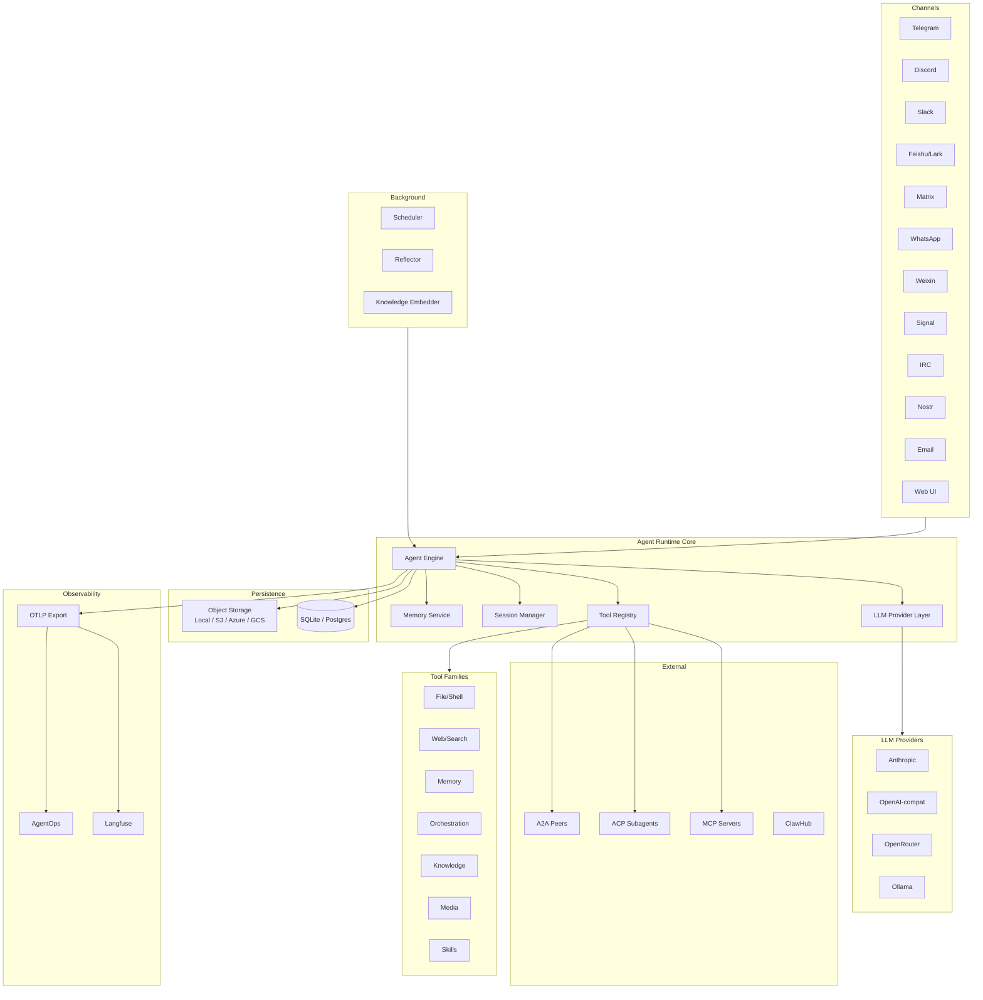
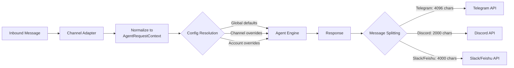
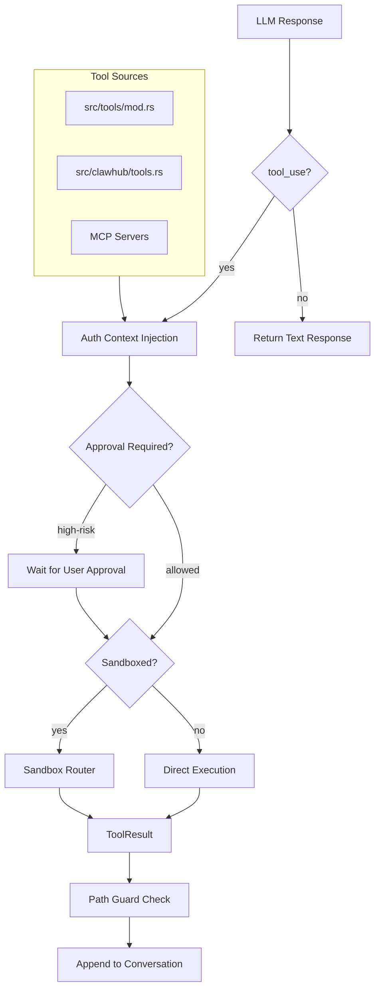
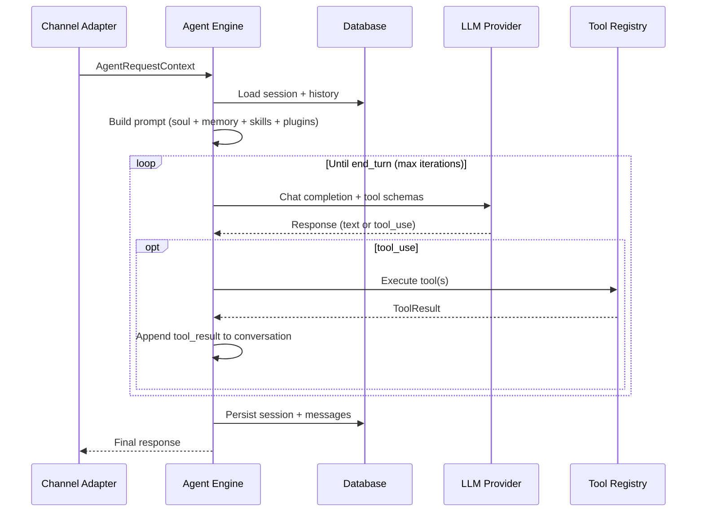
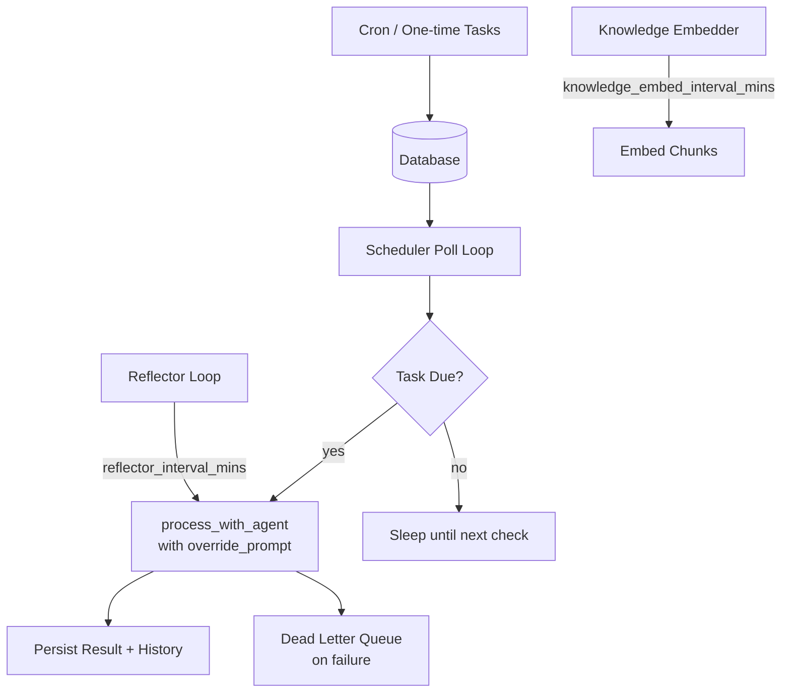
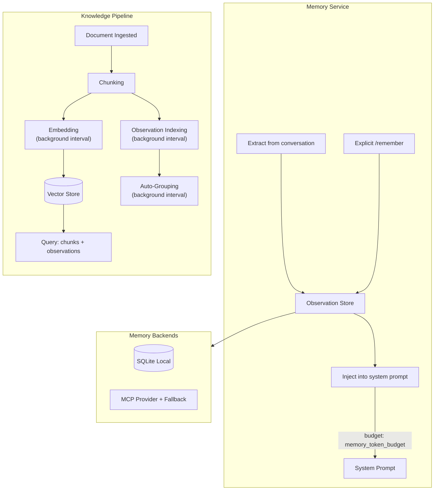
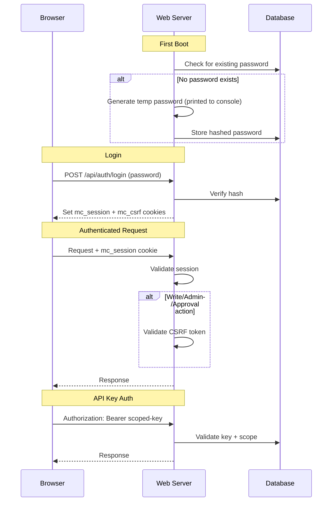

# mchact Architecture

This document is derived from the live codebase in `src/`, `crates/`, `web/`, and `mchact.config.example.yaml`. It is written for a new developer joining the project cold.

## Deployment Topology

Deployment topology, production hostnames, managed databases, and external service credentials are not encoded in the repository. All integration points are activated through `mchact.config.yaml` (override path via `MCHACT_CONFIG`). Below is a summary of what the code supports.

### Supported deployment shapes

| Shape | Database | Object storage | Notes |
|-------|----------|----------------|-------|
| Local / single-node | SQLite (default) | Local disk | Zero external dependencies. `cargo run -- start` with a config file. |
| Containerized | SQLite or Postgres | Local volume or cloud | Dockerfile (multi-stage, non-root `mchact` user), docker-compose with mounted config + data. Default port `10961`. |
| Production / multi-node | Postgres (`--features storage-postgres`) | S3 / Azure Blob / GCS (`--features storage-s3`, `storage-azure`, `storage-gcs`) | Cloud object storage uses an LRU disk cache (`storage_cache_max_size_mb`). |

### Web server

Bound to `web_host` (default `127.0.0.1`) and `web_port` (default `10961`). The embedded React SPA is served from the same binary. Rate limiting is per-session (`web_max_requests_per_window`, `web_rate_window_seconds`).

### External service credentials

All credentials are config-driven. None are compiled in or assumed. Key credential surfaces:

- **LLM providers** — `api_key`, `llm_base_url`, and `provider_presets` entries. Supports native Anthropic, OpenAI-compatible, OpenRouter, Ollama, DeepSeek, and others.
- **Channel tokens** — per-channel or per-account (`channels.<name>.accounts.<account>.*`): bot tokens, app secrets, webhook verification tokens, etc.
- **Object storage** — S3 keys (`storage_s3_access_key_id`), Azure connection strings (`storage_azure_connection_string`), GCS credentials (`storage_gcs_credentials_path`). Env vars (`AWS_ACCESS_KEY_ID`, `AZURE_STORAGE_CONNECTION_STRING`, `GOOGLE_APPLICATION_CREDENTIALS`) are also accepted.
- **Observability** — OTLP endpoints, Langfuse host/keys, AgentOps key.
- **Media providers** — TTS/STT/image/video API keys, embedding provider keys.
- **A2A / Gateway** — `a2a.shared_tokens`, `MCHACT_GATEWAY_TOKEN`.

See [`mchact.config.example.yaml`](/Volumes/Data/Codes/Local/mchact/mchact.config.example.yaml) for the full schema and defaults.

## System Overview

mchact solves the problem of running one agent runtime across many chat and operator surfaces without forking the core logic per channel. A message can enter from the local web UI, Telegram, Discord, Slack, Feishu/Lark, Matrix, Weixin, WhatsApp, Signal, IRC, Nostr, email, or other adapters, but it is processed by the same agent loop in [`src/agent_engine.rs`](/Volumes/Data/Codes/Local/mchact/src/agent_engine.rs).

The important architectural decisions are:

- The agent loop is channel-agnostic.
- The LLM layer is provider-agnostic.
- The tool runtime is centrally assembled and permission-aware.
- Persistence is split between relational state and object/file storage.
- Optional systems such as MCP, hooks, knowledge processing, OTLP export, plugins, A2A, ACP subagents, and training pipelines attach around the same core runtime.

## Tech Stack Decisions

### Rust workspace

- Rust is used for the entire runtime, channel integrations, persistence layer, and web server.
- The workspace split is deliberate: frequently reused primitives live in crates such as `mchact-core`, `mchact-storage`, `mchact-tools`, and `mchact-channels`, while the `mchact` binary crate owns orchestration.
- This keeps protocol and storage code reusable while letting the binary crate stay focused on composition.

### Tokio + async I/O

- `tokio` backs long-lived channel connections, the Axum web server, background schedulers, MCP calls, and streaming LLM/tool interactions.
- The codebase has many concurrent surfaces, so a single async runtime avoids per-integration threading models.

### Clap CLI

- `src/main.rs` exposes operational entry points such as `start`, `setup`, `doctor`, `gateway`, `skill`, `hooks`, `acp`, `knowledge`, `train`, `batch`, and `export`.
- This is not just a chat bot binary; it is also the operator control plane.

### Axum + embedded React SPA

- The operator UI and HTTP API are served by `src/web.rs` and `src/web/*`.
- `web/dist` is embedded into the binary via `include_dir`, which means the shipped binary can serve the UI without a second frontend server.
- The React app in `web/` is thin: it mostly wraps API calls, stream consumption, and settings/session management.

### SQLite first, Postgres optional

- SQLite is the default because the runtime is designed to be easy to run locally and as a single-node service.
- `mchact-storage` also supports Postgres behind a feature flag for larger deployments.
- This matches the code’s operator-first posture: simple default, more complex backend only when enabled explicitly.

### Object storage abstraction

- File-like payloads are not forced into the relational DB.
- `mchact-storage-backend` supports local disk plus S3, Azure Blob, and GCS backends.
- This separation keeps the relational store focused on metadata/state while large artifacts live in object storage.

### Native Anthropic + OpenAI-compatible LLM abstraction

- `src/llm.rs` supports a native Anthropic path and a broader OpenAI-compatible path.
- The codebase frequently resolves providers/models dynamically from config, channel overrides, and provider presets, so a provider abstraction is required.

### rmcp and ACP

- `rmcp` powers MCP federation.
- `agent-client-protocol` powers both `mchact acp` server mode and ACP-backed subagent execution.
- The project is intentionally integrating with external agent/tool ecosystems rather than operating as a closed system.

## Folder and Module Breakdown

## Top-level runtime modules in `src/`

- [`src/main.rs`](/Volumes/Data/Codes/Local/mchact/src/main.rs)
  - CLI entry point.
  - Owns command routing and setup/startup flow.

- [`src/runtime.rs`](/Volumes/Data/Codes/Local/mchact/src/runtime.rs)
  - Builds `AppState`.
  - Initializes storage, object storage, channels, skills, hooks, tools, LLM providers, embeddings, media, and observability exporters.
  - Registers enabled channel adapters.

- [`src/agent_engine.rs`](/Volumes/Data/Codes/Local/mchact/src/agent_engine.rs)
  - Shared multi-step agent loop.
  - Loads session state, injects memory/skills/context, compacts history, executes tool loops, persists results, and emits run events.
  - This is the runtime’s center of gravity.

- [`src/config.rs`](/Volumes/Data/Codes/Local/mchact/src/config.rs)
  - Config schema, defaults, normalization, path resolution, and compatibility migration.
  - Resolves legacy vs current config shapes into one in-memory model.

- [`src/llm.rs`](/Volumes/Data/Codes/Local/mchact/src/llm.rs)
  - Provider abstraction and request/response translation.
  - Handles tool-call capable chat completion flows, streaming, and provider-specific quirks.

- [`src/scheduler.rs`](/Volumes/Data/Codes/Local/mchact/src/scheduler.rs)
  - Scheduled task execution.
  - Memory reflector and other background loops.

- [`src/mcp.rs`](/Volumes/Data/Codes/Local/mchact/src/mcp.rs)
  - MCP client management.
  - Supports stdio and streamable HTTP transports.
  - Adds retries, circuit breaker, rate limiting, queue wait bounds, and tool discovery caching.

- [`src/hooks.rs`](/Volumes/Data/Codes/Local/mchact/src/hooks.rs)
  - Hook discovery and runtime execution.
  - Supports `BeforeLLMCall`, `BeforeToolCall`, and `AfterToolCall`.

- [`src/skills.rs`](/Volumes/Data/Codes/Local/mchact/src/skills.rs)
  - Skill catalog discovery and availability filtering.
  - Reads `SKILL.md` frontmatter, OS/dependency compatibility, and runtime enable/disable state.

- [`src/plugins.rs`](/Volumes/Data/Codes/Local/mchact/src/plugins.rs)
  - Manifest-driven plugin commands, tools, and context providers.
  - Enforces execution policy relative to sandbox capabilities.

- [`src/memory_backend.rs`](/Volumes/Data/Codes/Local/mchact/src/memory_backend.rs)
  - Provider abstraction for structured memory.
  - Uses SQLite locally and can front an MCP-backed memory provider with fallback.

- [`src/memory_service.rs`](/Volumes/Data/Codes/Local/mchact/src/memory_service.rs)
  - High-level memory logic around extraction, injection, and explicit remember flows.

- [`src/knowledge.rs`](/Volumes/Data/Codes/Local/mchact/src/knowledge.rs)
  - Knowledge collection CRUD, chunking, embedding/query helpers, and access rules.

- [`src/knowledge_scheduler.rs`](/Volumes/Data/Codes/Local/mchact/src/knowledge_scheduler.rs)
  - Background embedding/observation/autogroup workers for knowledge content.

- [`src/web.rs`](/Volumes/Data/Codes/Local/mchact/src/web.rs)
  - Axum router, embedded web asset serving, request quotas, SSE hubs, session locks, and boot-time web auth initialization.

- [`src/web/*.rs`](/Volumes/Data/Codes/Local/mchact/src/web)
  - Route modules for auth, config, skills, sessions, metrics, MCP, SSE streaming, and websocket/event helpers.

- [`src/gateway.rs`](/Volumes/Data/Codes/Local/mchact/src/gateway.rs)
  - Gateway/bridge service management and local RPC compatibility layer.
  - Owns install/start/status/log paths for long-running service mode.

- [`src/acp.rs`](/Volumes/Data/Codes/Local/mchact/src/acp.rs)
  - Runs mchact as an ACP server over stdio.

- [`src/acp_subagent.rs`](/Volumes/Data/Codes/Local/mchact/src/acp_subagent.rs)
  - Runs child agents through ACP as a subagent backend.
  - Handles permission requests, terminal/file events, transcript capture, and cancellation.

- [`src/a2a.rs`](/Volumes/Data/Codes/Local/mchact/src/a2a.rs)
  - Local agent card exposure and outbound peer configuration for agent-to-agent HTTP interactions.

- [`src/chat_commands.rs`](/Volumes/Data/Codes/Local/mchact/src/chat_commands.rs)
  - In-chat slash-style command handling and persisted session/channel overrides.

- [`src/clawhub/*.rs`](/Volumes/Data/Codes/Local/mchact/src/clawhub)
  - Runtime-side ClawHub CLI/service/tool wrappers.

- [`src/media_manager.rs`](/Volumes/Data/Codes/Local/mchact/src/media_manager.rs)
  - Media/file lifecycle management across extraction/generation/transcription providers and storage backends.

- [`src/batch.rs`](/Volumes/Data/Codes/Local/mchact/src/batch.rs), [`src/export.rs`](/Volumes/Data/Codes/Local/mchact/src/export.rs), [`src/rl.rs`](/Volumes/Data/Codes/Local/mchact/src/rl.rs), [`src/train_pipeline.rs`](/Volumes/Data/Codes/Local/mchact/src/train_pipeline.rs)
  - Offline data generation, export, RL, and training pipeline tooling.

### Channels in `src/channels/`

Each adapter owns transport-specific ingress/egress and runtime wiring. The set currently includes Telegram, Discord, Slack, Feishu/Lark, Matrix, WhatsApp, Weixin, Signal, IRC, Nostr, QQ, DingTalk, iMessage, and email.

These modules depend on:

- `mchact-channels` abstractions
- `AppState`
- provider/model override resolution in config
- shared agent execution in `agent_engine`

### Tools in `src/tools/`

`src/tools/mod.rs` assembles the built-in registry. The source tree groups tool families by concern:

- file and shell tools: `bash`, `read_file`, `write_file`, `edit_file`, `glob`, `grep`
- browser/web tools: `browser`, `browser_vision`, `web_fetch`, `web_search`
- memory tools: `memory`, `structured_memory`
- orchestration tools: `send_message`, `schedule`, `subagents`, `mixture_of_agents`, `a2a`
- knowledge/media/training tools: `knowledge`, `text_to_speech`, `image_generate`, `video_generate`, `training`, `rl_training`
- skills/tools bootstrap: `activate_skill`, `create_skill`, `sync_skills`

ClawHub tools are registered from [`src/clawhub/tools.rs`](/Volumes/Data/Codes/Local/mchact/src/clawhub/tools.rs), not from `src/tools/`, which matters for generated docs.

## Workspace crates in `crates/`

- [`crates/mchact-core`](/Volumes/Data/Codes/Local/mchact/crates/mchact-core)
  - Shared error types, LLM/tool payload types, and text helpers.

- [`crates/mchact-storage`](/Volumes/Data/Codes/Local/mchact/crates/mchact-storage)
  - Database traits, schema creation, migrations, query helpers, and storage drivers.
  - Owns sessions, messages, tasks, auth, audit, metrics, memory, knowledge metadata, and more.

- [`crates/mchact-storage-backend`](/Volumes/Data/Codes/Local/mchact/crates/mchact-storage-backend)
  - Object storage API for local disk and cloud backends.

- [`crates/mchact-tools`](/Volumes/Data/Codes/Local/mchact/crates/mchact-tools)
  - Core tool runtime primitives, auth context propagation, path guards, sandbox router, validation helpers, and todo storage helpers.

- [`crates/mchact-channels`](/Volumes/Data/Codes/Local/mchact/crates/mchact-channels)
  - Channel interfaces and routing helpers.

- [`crates/mchact-app`](/Volumes/Data/Codes/Local/mchact/crates/mchact-app)
  - App-level helpers such as logging, built-in skill assets, and transcription support.

- [`crates/mchact-memory`](/Volumes/Data/Codes/Local/mchact/crates/mchact-memory)
  - Observation store, derivation, injection, search, and peer-card systems.

- [`crates/mchact-media`](/Volumes/Data/Codes/Local/mchact/crates/mchact-media)
  - Media provider routing for transcription, speech, image, video, and document extraction.

- [`crates/mchact-observability`](/Volumes/Data/Codes/Local/mchact/crates/mchact-observability)
  - OTLP metrics/traces/logs exporters and vendor-specific adapters.

- [`crates/mchact-clawhub`](/Volumes/Data/Codes/Local/mchact/crates/mchact-clawhub)
  - Registry client, skill install logic, and lockfile handling for ClawHub.

## Web UI in `web/`

- `web/src/main.tsx` is the main composition root.
- `web/src/lib/api.ts` wraps the HTTP API.
- Hooks such as `use-auth`, `use-config`, `use-chat-adapter`, and `use-usage` coordinate page state with backend APIs.
- Most client state lives in React state/hooks rather than a separate global store.

## Data Flow

## 1. Chat message to response

More concretely:

1. An adapter or web endpoint constructs an `AgentRequestContext`.
2. `process_with_agent_with_events` in `agent_engine` loads the session, checks explicit-memory fast paths, and builds prompt context.
3. File memory, structured memory, skills catalog, plugin-provided context, and hook mutations are applied.
4. The provider in `llm.rs` is called with tool definitions.
5. If the model returns tool calls, `ToolRegistry` executes them with auth context and policy checks.
6. Tool results are appended and the loop continues until the provider returns a final assistant turn.
7. The session and message history are persisted through `mchact-storage`.
8. The response is sent back via the originating adapter or streamed to the web client.

## 2. Web request flow

1. `src/web.rs` builds the router and attaches auth/limits/run hubs.
2. Browser auth is verified through either session cookies or scoped API keys.
3. Write/admin/approval actions require CSRF validation for cookie-authenticated sessions.
4. Requests can stream incremental events over SSE.
5. Metrics and audit events are emitted alongside the primary result.

## 3. Scheduler and background work

1. Scheduled tasks are stored in the database.
2. `scheduler.rs` wakes up, selects due tasks, and re-enters the agent/runtime path.
3. Memory reflection, knowledge embedding, and other background processors run alongside the main runtime.

## 4. Knowledge/document flow

1. A document is ingested and extracted.
2. `KnowledgeManager` chunks it into pages/chunks.
3. Chunks are embedded if an embedding provider is configured and the build supports vector search.
4. Query paths fetch chunk matches and optional related observations.

## 5. Training/export flow

1. `batch` generates trajectories from prompt datasets.
2. `export` converts those trajectories to target formats.
3. `train` composes batch generation, export, and optional compression.
4. RL flows are exposed through both CLI and tools.

## Key Abstractions

### `AppState`

- Defined in [`src/runtime.rs`](/Volumes/Data/Codes/Local/mchact/src/runtime.rs).
- Central dependency container for config, DB, LLM provider, tools, skills, hooks, media, memory, observability exporters, and channel registry.
- Almost every long-lived subsystem depends on it.

### `Config`

- Defined in [`src/config.rs`](/Volumes/Data/Codes/Local/mchact/src/config.rs).
- This is not just deserialization. It also:
  - resolves defaults
  - expands paths
  - merges legacy `llm_providers` into `provider_presets`
  - migrates legacy channel config shapes
  - warns on deprecated web auth token fields

### `LlmProvider`

- Trait implemented by the provider layer in [`src/llm.rs`](/Volumes/Data/Codes/Local/mchact/src/llm.rs).
- Gives the rest of the runtime one interface for model invocation regardless of provider.

### `Tool` and `ToolRegistry`

- `Tool` comes from `mchact-tools::runtime`.
- `ToolRegistry` in [`src/tools/mod.rs`](/Volumes/Data/Codes/Local/mchact/src/tools/mod.rs) assembles concrete tools and injects auth context, defaults, sandboxing, and approval gating.
- This is why the model sees one coherent tool catalog even though implementations are spread across many modules.

### `ChannelAdapter` and `ChannelRegistry`

- Provided by `mchact-channels`.
- Every channel adapter implements a shared contract, which lets the runtime deliver outbound messages and resolve routing without transport-specific branching in the agent loop.

### `AgentRequestContext` and `AgentEvent`

- Defined in `agent_engine`.
- The request context carries caller/session/runtime information into the loop.
- Events drive streamed UX in the web layer and observability around runs.

### `SkillManager`

- Discovers and loads `SKILL.md` assets, filters by platform/dependency compatibility, and applies runtime enable/disable state.

### `HookManager`

- Discovers `HOOK.md` definitions, validates event registration, executes hook commands with bounded I/O, and applies allow/block/modify outcomes.

### `McpManager` / `McpServer`

- Own tool federation and remote tool invocation.
- The important design choice is that resilience logic lives in the MCP layer itself rather than being delegated entirely to callers.

### `MemoryBackend`

- Abstracts structured memory behind either local SQLite or an MCP-backed provider with fallback.
- This decouples memory storage strategy from the agent loop.

### `KnowledgeManager`

- Owns knowledge collection CRUD and query lifecycle separate from normal session chat state.

### Plugin manifests

- `PluginManifest`, `PluginToolSpec`, and `PluginContextProviderSpec` define a small declarative extension system for commands, tools, and prompt/document context injection.

## External Dependencies and Integrations

## LLM providers

- Native Anthropic.
- OpenAI-compatible providers, including OpenAI, OpenRouter, Ollama, DeepSeek, Google-compatible endpoints, and others configured through provider presets.

## Chat and operator surfaces

- Local web UI and HTTP API.
- Telegram, Discord, Slack, Feishu/Lark, Matrix, WhatsApp, Weixin, Signal, IRC, Nostr, QQ, DingTalk, iMessage, and email adapters.

## Persistence

- SQLite by default.
- Optional Postgres backend for relational state.
- Local or cloud object storage for large payloads and file-backed assets.

## Tool federation and agent ecosystems

- MCP for external tool servers.
- ACP for stdio server mode and ACP-based subagents.
- A2A for HTTP-based peer agent messaging.
- ClawHub for skill search/install and lockfile state.

## Observability and external sinks

- OTLP metrics, traces, and logs.
- Vendor adapter paths for Langfuse and AgentOps.

## Media and document providers

- Speech-to-text, text-to-speech, image generation, video generation, and document extraction are routed through configurable providers and the media manager.

## State Management

## Backend state

State is intentionally split by concern:

- relational state in `mchact-storage`
  - chats and messages
  - sessions and session settings
  - scheduled tasks and DLQ/history
  - structured memory
  - auth passwords, sessions, API keys
  - audit logs
  - metrics history
  - knowledge metadata and access control

- object/file state in storage backend
  - memory files
  - hook state files
  - skill assets and runtime state
  - uploaded media and generated artifacts
  - exports and other large payloads

- in-memory runtime state
  - `AppState`
  - request/run/session hubs in the web server
  - channel registry
  - transient observability/exporter buffers

## Frontend state

The React UI uses local component/hook state rather than Redux or another central store:

- auth status and session state via `use-auth`
- config forms via `use-config`
- current chat/thread state via chat adapter hooks
- usage and metrics panels via dedicated data hooks

The browser session itself is backed by `mc_session` and `mc_csrf` cookies when using cookie auth.

## Auth and Security

## Web auth

The web layer no longer uses a static bearer token config as the primary auth model.

- Operator password hashes are stored in the database.
- Login creates:
  - `mc_session` cookie
  - `mc_csrf` cookie
  - response-body `csrf_token`
- API keys are scoped:
  - `operator.read`
  - `operator.write`
  - `operator.admin`
  - `operator.approvals`
- Cookie-authenticated write/admin/approval requests require CSRF validation.
- On first boot, if no password exists, the server attempts to generate and store a temporary password; if that fails, it falls back to a bootstrap token delivered via `x-bootstrap-token`.

## Tool execution safety

- File tools are guarded by path validation in `mchact-tools`.
- Shell/file operations can be sandboxed through the sandbox router.
- High-risk tools can require explicit approval before execution.
- Tool auth context is injected by the host runtime, not delegated to the model.

## Channel and cross-chat permissions

- Control chats can access cross-chat operations.
- Regular chats are limited to their own routing boundary.
- Some plugin and tool paths can require control-chat privileges explicitly.

## External integration safeguards

- MCP servers use request timeouts, bounded concurrency, rate limits, retries, and circuit breakers.
- Hook execution uses bounded input/output and timeout limits.
- A2A inbound access uses shared bearer tokens.
- Web hook endpoints depend on `channels.web.hooks_token`.

## Known Complexity and Gotchas

- **Config accepts old and new field names.** `Config::load()` in `src/config.rs` silently migrates legacy fields (e.g. `llm_providers` → `provider_presets`, flat channel fields → `accounts` sub-maps). This means a config file can work even if it uses outdated field names, but `mchact.config.example.yaml` alone will not show you all accepted shapes. When debugging config issues, read `Config::load()` to see the full normalization logic.

- **`website/` is a separate repository.** Some older docs and scripts still reference a `website/` directory as if it lives in this repo. It does not — the public-facing site and docs are maintained in a separate git repository. The only UI in this repo is the embedded React app in `web/`.

- **Tool registration is split across two locations.** Built-in tools are registered in `src/tools/mod.rs`, but ClawHub tools are registered from `src/clawhub/tools.rs`. If you are looking for where a tool is defined or trying to list all available tools, you need to check both locations.

- **Application state lives in three places.** Relational data (messages, sessions, scheduled tasks, auth, metrics) is in SQLite or Postgres. File-like data (memory files, media, archives, skill assets) is in object storage (local disk or S3/Azure/GCS). Runtime state files (per-chat overrides, hook state) live in filesystem directories under `data_dir/runtime/`. When debugging, check all three — a missing file in object storage can cause failures that look like database issues.

- **In-process and ACP subagents behave differently.** The `sub_agent` tool spawns a restricted in-process agent loop with only 9 allowed tools (no `send_message`, `write_memory`, `schedule`, or recursive `sub_agent`). ACP subagents (`src/acp_subagent.rs`) run as external processes via the Agent-Client Protocol with their own tool sets, permissions, and lifecycle. They share the concept of delegated work, but their capabilities and error handling are not interchangeable.

- **First-boot auth uses a temporary password.** On first startup with no existing password in the database, the server generates a random password and prints it to the console. If that fails, it falls back to a bootstrap token delivered via the `x-bootstrap-token` HTTP header. This path is easy to miss if you only search for API key or bearer token auth patterns. See `src/web/auth.rs` for the full flow.

- **Channel config merges multiple levels.** A channel's effective configuration is resolved by merging: global defaults → channel-level settings → account-level settings → per-channel provider/model overrides. For example, a Telegram account can override the LLM model used, which takes precedence over the global `model` field. When a channel behaves unexpectedly, check all levels in the config.

- **Webhook-based channels have more transport logic.** Channels like Weixin, WhatsApp, and DingTalk use webhook ingress with verification tokens, encryption, and callback signatures. They require more setup (public URLs, webhook registration) and have more transport-specific code than polling-based channels like Telegram or websocket-based channels like Slack/Feishu. Expect a larger code surface when working on these adapters.

- **Knowledge processing is a multi-stage async pipeline.** When a document is ingested, it passes through four independent stages: (1) extraction and chunking, (2) observation indexing, (3) embedding for vector search, and (4) auto-grouping. Each stage runs on its own background interval (`knowledge_embed_interval_mins`, `knowledge_observe_interval_mins`, `knowledge_autogroup_interval_mins`). A document appearing in the database does not mean it has been embedded or grouped yet — check the stage-specific state if search or grouping results seem incomplete.

## Suggested Reading Order

If you are new to the codebase, this is the shortest path to working context:

1. [`src/main.rs`](/Volumes/Data/Codes/Local/mchact/src/main.rs)
2. [`src/runtime.rs`](/Volumes/Data/Codes/Local/mchact/src/runtime.rs)
3. [`src/agent_engine.rs`](/Volumes/Data/Codes/Local/mchact/src/agent_engine.rs)
4. [`src/config.rs`](/Volumes/Data/Codes/Local/mchact/src/config.rs)
5. [`src/tools/mod.rs`](/Volumes/Data/Codes/Local/mchact/src/tools/mod.rs)
6. [`src/web.rs`](/Volumes/Data/Codes/Local/mchact/src/web.rs)
7. [`src/mcp.rs`](/Volumes/Data/Codes/Local/mchact/src/mcp.rs)
8. [`src/memory_backend.rs`](/Volumes/Data/Codes/Local/mchact/src/memory_backend.rs)
9. [`src/skills.rs`](/Volumes/Data/Codes/Local/mchact/src/skills.rs)
10. [`mchact.config.example.yaml`](/Volumes/Data/Codes/Local/mchact/mchact.config.example.yaml)
